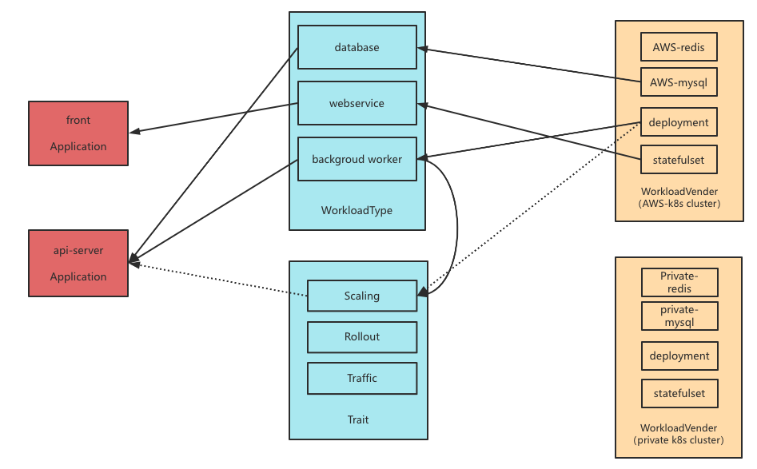

[TOC]

# 概述

该模型试图解决的核心问题如何面向微服务的架构描述、组织应用，而不是如何编写应用程序。

## 模型

- Application：应用，一系列工作负载的集合。
- Workload：工作负载，可独立运行的单元。
- WorkloadType：工作负载类型，定义了不同类型的工作负载，比如：webserver，task 等。
- Trait：附加在 workload 上为其提供特殊能力，比如 Autoscaling，监控告警等。
- WorkloadVender：工作负载类型的具体实现，通常是基于某一种具体运行时环境写的配置文件，比如 k8s yaml。
